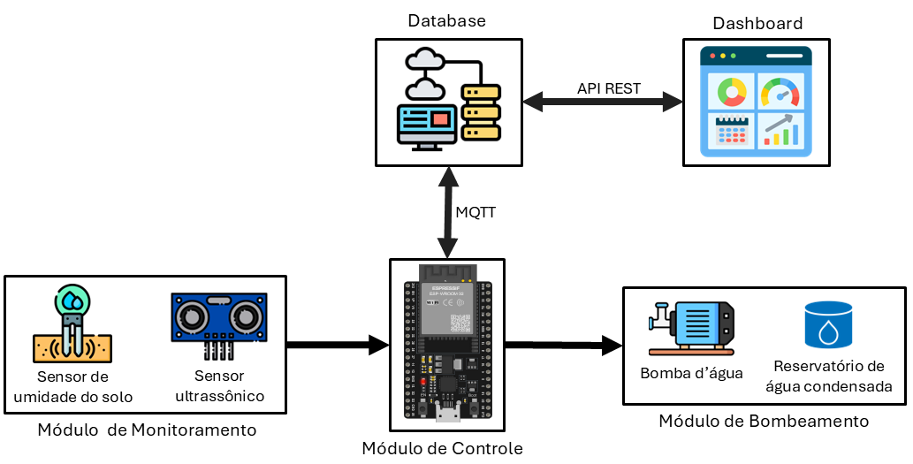

# Protótipo automatizado com ESP32 para monitoramento e controle de irrigação com água condensada de ar-condicionado

  

<em>Figura 1 – Esquemático do protótipo</em>

## Sumário

- [Visão Geral](#visao-geral)
- [Principais Funcionalidades](#principais-funcionalidades)
- [Ciclo Operacional](#ciclo-operacional)
- [Arquitetura e Módulos do Sistema](#arquitetura-e-modulos)
- [Configuração do Sistema](#configuracao)
- [Hardware utilizado](#hardware)
- [Licença](#licenca)

---

## 🔎 Visão Geral

Este repositório contém o código-fonte de um **protótipo de sistema de irrigação inteligente**, desenvolvido sobre a plataforma **ESP32**, com foco em **eficiência energética**, **automação** e **monitoramento remoto**.

O sistema realiza:
- Monitoramento da umidade do solo;
- Medição do nível de água de um reservatório;
- Gerenciamento do consumo energético via *deep sleep*;
- Controle automático da irrigação com regras de segurança.

Todos os dados coletados (sensores e estado do sistema) são publicados remotamente via **MQTT**, permitindo **monitoramento em tempo real** por aplicações externas.

---

## ⚙️ Principais Funcionalidades

- **Monitoramento de Umidade do Solo**: Leitura contínua por sensor capacitivo, com classificação em faixas qualitativas (*Muito Seco*, *Seco*, *Ideal*, *Encharcado*).

- **Controle do Nível do Reservatório**: Utiliza um sensor ultrassônico para medir a distância até a água, calculando o volume restante em litros e a porcentagem da capacidade.

- **Gerenciamento de Bateria**: Monitoramento da tensão da bateria e estimativa do *State of Charge* (SoC).

- **Irrigação Automatizada**: Acionamento da bomba d’água com base em regras predefinidas de umidade do solo. Inclui **mecanismos de proteção**, impedindo o funcionamento com reservatório vazio.

- **Modo de Baixo Consumo (Deep Sleep)**: O ESP32 permanece em modo de baixo consumo (deep sleep) na maior parte do tempo, acordando em intervalos programados para realizar leituras, enviar dados e retornar ao modo de hibernação, otimizando drasticamente a vida útil da bateria. Tal funcionalidade foi desenvolvida levando em conta que, em condições normais, a umidade de um solo nao varia muito em intervalos pequenos, o que nos permite programar o funcionamento do sistema para atuar em intervalos.

- **Comunicação Remota via MQTT**: Conecta-se a uma rede Wi-Fi para publicar todos os dados coletados (umidade, volume de água, bateria, estado da bomba) em um broker MQTT, permitindo o monitoramento à distância.

---

## 🔁 Ciclo Operacional

O sistema foi projetado para maximizar a eficiência energética seguindo o ciclo abaixo:

1. **Despertar (Wake Up)**: A ESP32 acorda do *deep sleep* após um intervalo configurado (ex.: 10 minutos).

2. **Ciclo Ativo**: Permanece ativo por um curto período (ex.: 300 segundos), estabelecendo conexões e inicializando sensores.

3. **Leitura e Ação**: Em intervalos regulares (ex.: a cada 35 segundos), o sistema:
   - lê os sensores de solo, reservatório e bateria;
   - avalia as regras de irrigação;
   - publica os dados via MQTT.

4. **Hibernação (Deep Sleep)**: Finalizado o ciclo ativo, o ESP32 retorna ao *deep sleep* até o próximo despertar.

---

## 🧩 Arquitetura e Módulos do Sistema

O projeto é estruturado de forma **modular**, facilitando manutenção, testes e expansão.

| Arquivo                         | Descrição                                                                 |
|--------------------------------|---------------------------------------------------------------------------|
| `System_w_deepsleep.ino`        | Arquivo principal que coordena o ciclo operacional do sistema.           |
| `Broker.cpp` / `Broker.h`       | Gerenciamento da conexão Wi-Fi e comunicação MQTT.                        |
| `SoilMoistureSensor.cpp` / `.h` | Leitura e interpretação do sensor de umidade do solo.                    |
| `UltrassonicSensor.cpp` / `.h`  | Medição do nível de água e cálculo do volume do reservatório.            |
| `BatterySensor.cpp` / `.h`      | Monitoramento da tensão da bateria e cálculo do SoC.                     |
| `WaterPump.cpp` / `.h`          | Controle da bomba d’água, incluindo regras e temporizadores de segurança.|
| `DeepSleep.cpp` / `.h`          | Implementação da lógica de *deep sleep* e despertar do ESP32.            |

---

## Configuração
As principais variáveis do sistema podem ser ajustadas nos arquivos de cabeçalho (`.h`) correspondentes:

*   **`Broker.h` / `Broker.cpp`:**
    *   As credenciais de Wi-Fi (`WIFI_SSID`, `WIFI_PASS`) e MQTT (`MQTT_HOST`, `MQTT_PORT`, `MQTT_USER`, `MQTT_PASS`, `MQTT_TOPIC`) são gerenciadas internamente. É esperado um arquivo `config.h` para armazenar essas informações sensíveis.
*   **`DeepSleep.h`:**
    *   `DEEP_SLEEP_TIME_MIN`: Tempo que o dispositivo passa em *deep sleep* (em minutos).
    *   `AWAKE_CYCLE_TIME_SEC`: Duração do ciclo ativo após despertar (em segundos).
    *   `SENSOR_READ_INTERVAL_SEC`: Intervalo entre as leituras de sensores durante o ciclo ativo.
*   **`SoilMoistureSensor.h`:**
    *   `DRY_VALUE`, `WET_VALUE`: Valores brutos do sensor correspondentes a solo seco e encharcado, usados para calibrar o percentual de umidade.
*   **`WaterPump.h`:**
    *   `SOIL_TARGET_ON`: Percentual de umidade abaixo do qual a bomba é ativada.
    *   `RES_MIN_PCT`: Percentual mínimo do reservatório para a bomba poder operar.
    *   `PUMP_RUN_TIME`: Duração do acionamento da bomba em milissegundos.

---

## 🔩 Hardware utilizado

- Placa de desenvolvimento **ESP32**
- Sensor de umidade do solo capacitivo (GPIO 36)
- Sensor ultrassônico **HC-SR04**
  - Trig: GPIO 32
  - Echo: GPIO 33
- Bomba d’água de baixa tensão
- Módulo relé (GPIO 16)
- Bateria Li-Ion / LiPo
- Circuito divisor de tensão para leitura da bateria  
  (GPIOs 34 e 4)

---

## 📄 Licença

Este projeto está licenciado sob a **Licença MIT**.  
Consulte o arquivo [LICENSE](LICENSE) para mais informações.
